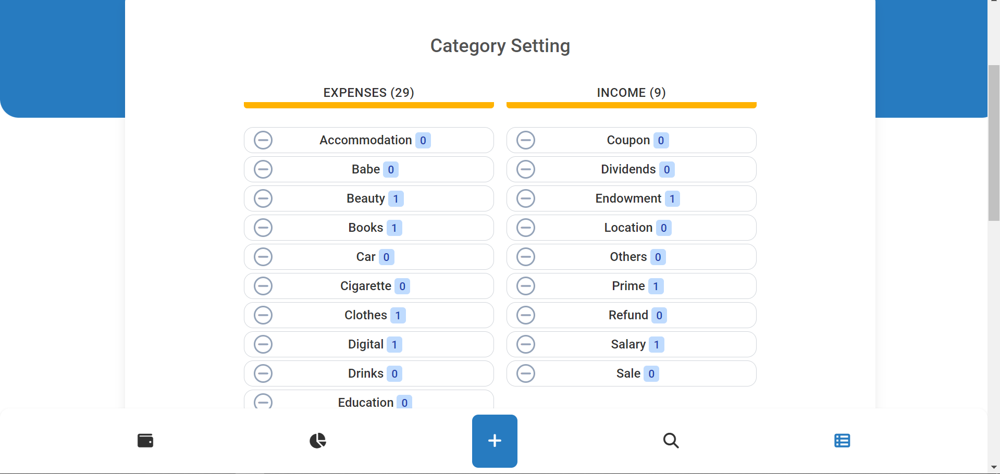

<a name="readme-top"></a>

<div align="center">
  <a href="https://github.com/souf1neCoder/Souftrack">
    
  </a>

  <h3 align="center">Souftrack</h3>

  <p align="center">
    A powerful and user-friendly single-page application!
  </p>
</div>

## Souftrack
- Effortlessly Track and Manage Your Budget
- Real-time Budget Tracking and Insights
- Streamlined Expense and Income Tracking
- Stay Organized and Never Miss a Beat
- Ideal for Individuals and Small Businesses
- Start Your Journey to Financial Empowerment
<p align="right">(<a href="#readme-top">back to top</a>)</p>

## Project Overview

<table>
    <tr>
        <td></td>
        <td></td>
        <td></td>
   </tr> 
    <tr>
        <td></td>
        <td></td>
        <td></td>
    </tr>
    <tr>
        <td></td>
        <td></td>
        <td></td>
   </tr> 
    <tr>
        <td></td>
        <td></td>
        <td></td>
    </tr> 
</table>
<p align="right">(<a href="#readme-top">back to top</a>)</p>

## Mobile First

<div align="center">

</div>

<p align="right">(<a href="#readme-top">back to top</a>)</p>

## Built With
<a href="https://laravel.com/" target="_blank" rel="noreferrer"> 
<a href="https://vuejs.org/" target="_blank" rel="noreferrer"> 
<a href="https://tailwindcss.com/" target="_blank" rel="noreferrer">  </a>
<p align="right">(<a href="#readme-top">back to top</a>)</p>

## Starting Project

1. install laravel packs

```composer
composer install
```

1. Run the following command to generate your app key:

```
cp .env.example .env && php artisan key:generate
```

2. install npm and run

```npm
npm install
```

```npm
npm run dev
```
<p align="right">(<a href="#readme-top">back to top</a>)</p>

## Generate Data

```
php artisan db:seed
```

<p align="right">(<a href="#readme-top">back to top</a>)</p>

<!-- CONTRIBUTING -->
## Contributing

Contributions are what make the open source community such an amazing place to learn, inspire, and create. Any contributions you make are **greatly appreciated**.

If you have a suggestion that would make this better, please fork the repo and create a pull request. You can also simply open an issue with the tag "enhancement".
Don't forget to give the project a star! Thanks again!

1. Fork the Project
2. Create your Feature Branch (`git checkout -b feature/AmazingFeature`)
3. Commit your Changes (`git commit -m 'Add some AmazingFeature'`)
4. Push to the Branch (`git push origin feature/AmazingFeature`)
5. Open a Pull Request

<p align="right">(<a href="#readme-top">back to top</a>)</p>

<!-- CONTACT -->
## Contact

<a href="https://www.linkedin.com/in/soufiane-mchanna/" target="blank"></a>

<p align="right">(<a href="#readme-top">back to top</a>)</p>
<!-- LICENSE -->

## License

Distributed under the MIT License. See `LICENSE.txt` for more information.

<p align="right">(<a href="#readme-top">back to top</a>)</p>
